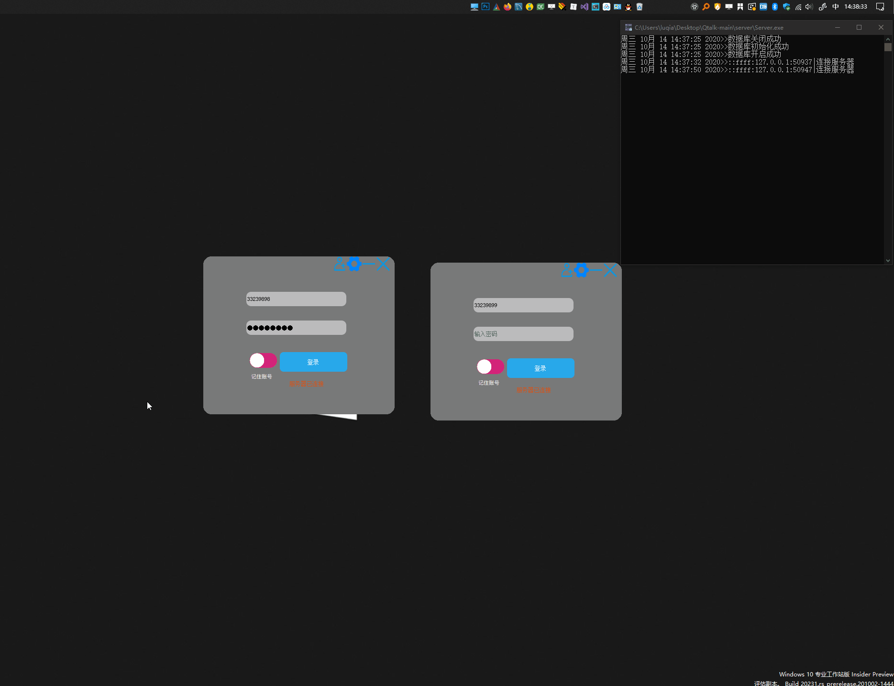

## Qtalk v0.2.0版本功能简介
#### 快速演示

## 更新内容
- 数据库改为sqlite，考虑到mysql和sqlserver配置繁琐，此软件也用不到这么大的数据库，所以采用sqlite，并且Qt自带sqlite驱动，免去了数据库的配置
- 密码长度和账号长度不低于8位
- 密码加入MD5映射，增加安全性
- 针对中文乱码和linux与windows平台编码问题进行优化（不保证100%没问题）
- 托盘加入退出按钮
- 增加了头像功能，双击头像区域选择文件上传，目前支持（jpg,png,jpeg,bmp）格式
- 加载好友列表时可以自动获取好友头像
- 界面细节优化
- 修复当一个用户下线后，其他用户在线列表显示该用户还在线的问题
- 修复当正在聊天时对方下线仍显示发送成功的问题
## 已知问题
- 客户端先打开，服务器后打开，然后客户端配置服务器地址和端口后，客户端显示已经连接服务器，但是服务器无响应，暂时解决办法：***保证先运行服务器程序***
## TODO
 - [ ] emoji和颜文字
 - [ ]  加入单独的昵称和账号机制
 - [ ] 改进已知问题

## 软件介绍
   Qtalk是一个基于Qt的局域网聊天软件，支持用户注册功能，密码加密，一对一聊天，记住账号，上传头像等功能。初衷是熟悉Qt的使用和增加项目构建经验（***俗称练手***），此软件用到了Qt 的基础容器（list map），网络功能，数据库功能，json,ini，图像，文件操作等功能，比较适合小白练手，快速掌握Qt的各个功能以及怎样构建一个小项目，代码总共不到三千行，逻辑还凑合吧，注释的话，基本的关键性注释都有，每注释的地方仔细琢磨都能看懂。
>windows和linux都编译通过（windows10 201002版本，vs2019 vc编译器 19.28.29304.1 版）（ubuntu 20.04 gcc-10）,qt版本5.15

### 使用说明

代码仓里的client和server文件夹中有对应的编译好的exe直接运行即可，如果提示缺少XXX的，文件夹了的vc_redist.x64.exe安装一下就行了，第一次运行点击右上角的齿轮按钮配置服务器，默认端口号为12345，ip为服务器程序运行的电脑的局域网ip，配置好后需要关闭软件再重新打开（这是个bug，以后修复后不用重启了就）